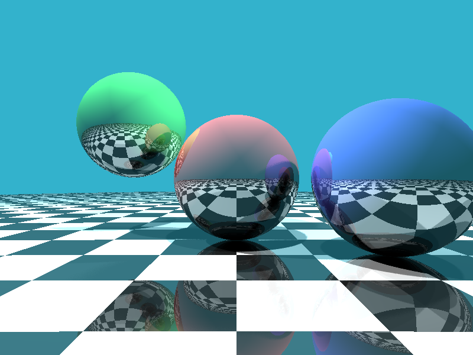

# GoTracer

GoTracer is a concurrent ray tracing renderer implemented in Go. It demonstrates the power of Go's concurrency features while producing visually appealing 3D renderings.

## Sample



## Features

- Concurrent rendering using Goroutines
- Soft shadows for realistic lighting
- Reflections with configurable bounce depth
- Multiple light sources
- Spherical objects and a checker-board ground plane
- BMP image output

## Requirements

- Go 1.13 or later

## Installation

Clone the repository:

```bash
git clone https://github.com/yourusername/GoTracer.git
cd GoTracer
```

## Usage

To run GoTracer with default settings:

```bash
go run main.go
```

To specify the maximum number of ray bounces:

```bash
go run main.go -bounces 5
```

The program will generate an `output.bmp` file in the current directory.

## Customization

You can modify the scene by editing the `main` function in `main.go`:

- Adjust the `width` and `height` variables to change the image resolution
- Modify the `spheres` slice to add, remove, or reposition spheres
- Adjust the `lights` slice to change the lighting setup

## Performance

Rendering time depends on the image resolution, number of objects, lighting complexity, and maximum bounce depth. Increasing these parameters will result in longer rendering times but potentially more detailed images.

## Future Improvements

- Add more geometric primitives (e.g., planes, triangles)
- Implement texture mapping
- Add anti-aliasing for smoother edges
- Introduce more material properties (e.g., refraction, glossiness)
- Implement a scene description file format for easier scene setup
- Optimize performance with advanced acceleration structures

## Contributing

Contributions are welcome! Please feel free to submit a Pull Request.

## License

This project is open source and available under the [MIT License](LICENSE).
